# UART UVM Verification Project

## Overview
UART design + SystemVerilog/UVM verification environment, verified against the
[Verification Plan](docs/UART_Verification_Plan.md). Simulated on Synopsys VCS
via EDA Playground.

The DUT is a single-chip **UART echo/loopback** design (`UART.sv`): a byte
received on `Rx_pin` is automatically re-transmitted on `Tx_pin` — there is no
parallel data port at the top level, no parity, and no FIFO. See the
Verification Plan for the full design summary.

## Architecture

Verification is split into **3 independent tiers**, each with its own
interface, UVM package, and `env` — all three drive the *same* RTL, at
different levels of the hierarchy:

```mermaid
flowchart TB
    subgraph RXT["RX-tier — my_uart_rx_pkg"]
        direction LR
        rxseq[sequence] --> rxsqr[sequencer] --> rxdrv[driver]
        rxdrv -- "bit-bang Rx_Din" --> rxdut[["UART_RX.sv"]]
        rxdut -- "Rx_Dout / Rx_IRQ" --> rxmon[monitor]
        rxmon --> rxscb[scoreboard]
        rxmon --> rxcov[coverage]
    end

    subgraph TXT["TX-tier — my_uart_tx_pkg"]
        direction LR
        txseq[sequence] --> txsqr[sequencer] --> txdrv[driver]
        txdrv -- "Tx_start / Tx_Din" --> txdut[["UART_TX.sv"]]
        txdut -- "Tx_Dout / Tx_Ready" --> txmon[monitor]
        txmon --> txscb[scoreboard]
        txmon --> txcov[coverage]
    end

    subgraph ECT["Echo-tier — my_uart_top_pkg"]
        direction LR
        eseq[sequence] --> esqr[sequencer] --> edrv[driver]
        edrv -- "bit-bang Rx_pin" --> edut[["UART.sv (full DUT)"]]
        edut -- "Tx_pin" --> emon[monitor]
        emon --> escb[scoreboard]
        emon --> ecov[coverage]
    end
```



- **RX-tier / TX-tier** — unit-level, drive/observe the parallel ports of
  `UART_RX`/`UART_TX` directly. Easiest to debug in isolation.
- **Echo-tier** — integration-level, only sees `Rx_pin`/`Tx_pin` (the real
  external pins), so driver/monitor bit-bang the serial protocol themselves
  — same as a real external UART device would.

For the post-synthesis RTL schematic (gate-level view of `UART.sv`, generated
during synthesis), see [`rtl/image.png`](rtl/image.png).

## Status

✅ **All 3 tiers verified — RTL bugs found & fixed, 100% functional coverage reached**

| Tier | Test cases | Result |
|---|---|---|
| RX  | basic, corner-data, back-to-back, glitch, reset-mid-frame | All PASS |
| TX  | basic, corner-data, reset-while-serializing | All PASS (1 race condition found & fixed) |
| Echo | random (up to 500 samples, 100% coverage), back-to-back (F8 characterization), stress (1000 samples) | All PASS |

**RTL bugs found and fixed** (see [Debug Log](docs/UART_Verification_Plan.md#8-debug-log--root-cause-không-chỉ-kết-quả) for full root-cause writeups):
- Naming-mismatch bugs in `UART_TX.sv` / `UART_RX.sv` causing broken signal connections (found via static code review)
- `BaudClkGenerator.sv`: `baudclk` pulse never asserted (stuck at 0)
- `ShiftRegister.sv`: `ShiftEn` port direction was backwards
- `UART_RX.sv`: `ShiftEn` gating bug — start/stop bit samples corrupted the 8-bit shift register
- `Sync.sv`: reset value zero-extended incorrectly, causing a spurious edge right after reset (root cause of an intermittent reset-recovery failure)
- Testbench-side race condition: `wait(Tx_Ready==1)` could return immediately before `Tx_Ready` actually dropped, letting the driver issue back-to-back `Tx_start` pulses too early

**Known architectural limitation (by design, not a bug):**
No buffering on the echo path — sending bytes back-to-back with no gap can
corrupt or drop echoed data (~37% "torn data", ~1% fully dropped bytes at
sustained max rate). Characterized and documented, not something to fix
given the current spec.

See [Verification Plan](docs/UART_Verification_Plan.md) for the full test
plan, feature list, and sign-off criteria/regression log.

## Repo structure

```
rtl/
├── UART.sv                  # top-level echo DUT
├── BaudClkGenerator.sv
├── UART_RX/                 # UART_RX.sv, Sync.sv, ShiftRegister.sv
└── UART_TX/                 # UART_TX.sv, Serialiser.sv

tb/
├── directed_testbench/      # early directed (non-UVM) tests
└── uvm/
    ├── rx_test_cases/       # RX-tier UVM package, one file per test case
    ├── tx_test_cases/       # TX-tier UVM package
    └── top_test_case/       # Echo-tier UVM package

docs/
└── UART_Verification_Plan.md
```


## How to run (EDA Playground)

Each tier is self-contained — pick one:

1. **`design.sv`**: paste `rtl/UART.sv`, `rtl/BaudClkGenerator.sv`, and the
   contents of `rtl/UART_RX/` + `rtl/UART_TX/` (all 5 RTL files, regardless
   of which tier you're running — they're one compilation unit).
2. **`testbench.sv`**: paste the contents of *one* file from
   `tb/uvm/rx_test_cases/`, `tb/uvm/tx_test_cases/`, or `tb/uvm/top_test_case/`
   (each is a complete package + top module for that tier/test case).
3. Enable UVM 1.2, select Synopsys VCS, click Run.

To try a different test case, swap in a different file from the same
directory — package/env/interface stay the same, only the sequence differs.
